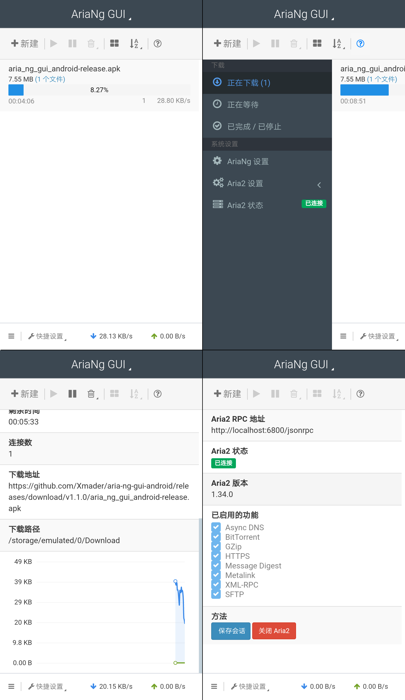

# AriaNg GUI for Android

> 一个 Aria2 图形界面安卓应用程序

## 特性

* 集成aria2c
* 多线程下载
<!-- * 未完成任务退出自动保存 (Bug: 需要暂停才能保存进度) (开发中...) -->
* 支持PT/BT
<!-- * 下载完成消息通知 (开发中...) -->
* 多语言支持
* 支持配置多个 aria2 RPC
<!-- * 支持打开下载文件夹, 在文件管理器中显示已下载的文件 (仅限使用内置的Aria2 RPC) (开发中...) -->
* 使用响应式布局, 支持各种计算机或移动设备
* 友好的界面交互

## [下载Android版](https://github.com/Xmader/aria-ng-gui-android/releases/latest)

## [查看 Windows、 Linux 和 MacOS 版](https://github.com/Xmader/aria-ng-gui)

---

# AriaNg GUI for Android

> An Aria2 GUI Android App

## Features

* Integrate aria2c
* Multi-Thread Download
* PT/BT support
* Multi-languages support
* Multi aria2 RPC host support
* Responsive design, supporting desktop and mobile devices
* User-friendly interface

## [Download](https://github.com/Xmader/aria-ng-gui-android/releases/latest)

## [View Aria2 GUI for Windows & Linux & MacOS](https://github.com/Xmader/aria-ng-gui)

---

## 屏幕截图 | Screenshots

[点我查看](img/)

